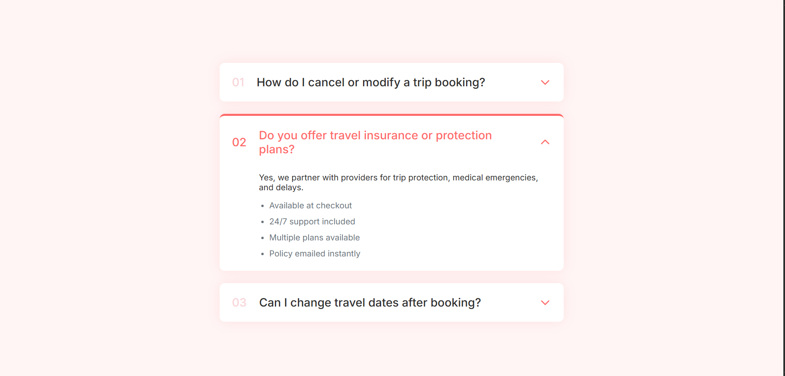

# 📂 Responsive FAQ Accordion Component

A clean and interactive **FAQ accordion interface** designed for travel-related questions.  
Built with semantic HTML, modern CSS styling, and JavaScript-powered toggle animations. Fully responsive and user-friendly across all devices.

---

## 🎨 Features

- 📌 Click-to-toggle accordion items
- ✨ Smooth open/close animations
- 📱 Fully responsive design for mobile and desktop
- 🧠 Semantic HTML structure for accessibility
- 🎯 Ideal for booking sites, help centers, and travel UIs

---

## 🛠️ Built With

| Technology    | Purpose                 |
| ------------- | ----------------------- |
| 🧱 HTML5      | Structure               |
| 🎨 CSS3       | Styling & Responsive UI |
| ⚙️ JavaScript | Accordion Interactivity |

---

## 📸 Screenshot

---

## 🌐 Live Demo

🔗 **View it on GitHub Pages:**

---

## 📧 Connect with Me 📂

🔗 **LinkedIn:**  
https://www.linkedin.com/in/gaurav-lad1974

📨 **Email:**  
gauravlad1974@gmail.com
